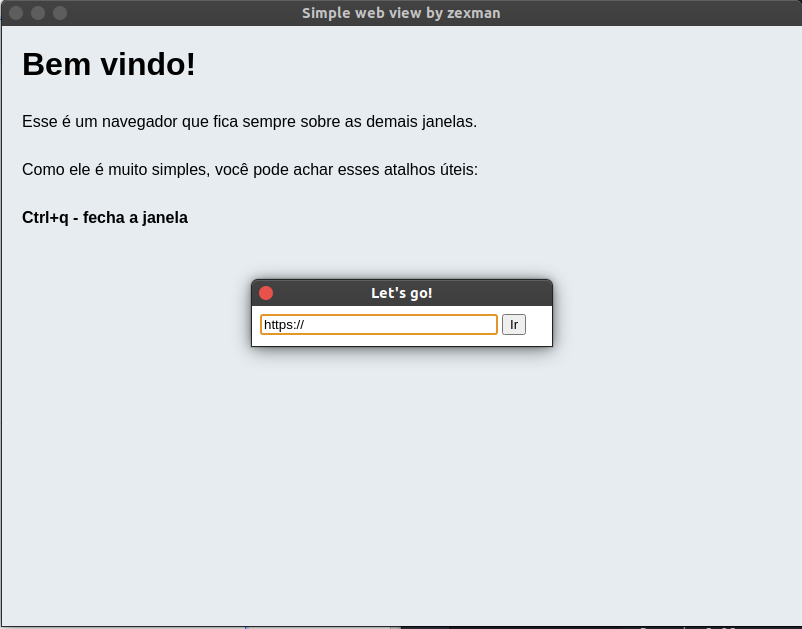

# simple-webview




> A little aways on top browser screen.

This project was inspired by [Mike Brito](https://github.com/maykbrito) [youtube video](https://www.youtube.com/watch?v=zy-B9d2ZVrw) and [ourcodeworld](https://ourcodeworld.com/articles/read/536/how-to-send-information-from-one-window-to-another-in-electron-framework).

## :house_with_garden: [Homepage](https://github.com/zexmandev/simple-webview#readme)

## :construction: Install

```terminal
yarn install
```

## :fire: usage

```terminal
yarn start
```

## Built With

---

- [Electron](https://www.electronjs.org/) - Build cross-platform desktop apps with JavaScript, HTML, and CSS

---

## :bust_in_silhouette: Author

- **Zexman**

* website: [zexman](http://zexman.com.br/)
* Twitter:[@zexman](https://twitter.com/zexmanbr)
* Github: [@zexman](https://github.com/zexmandev)
* Likedin: [@zexman](https://www.linkedin.com/in/zexmandev/)

## support

## give a :star: if this project helped you!
